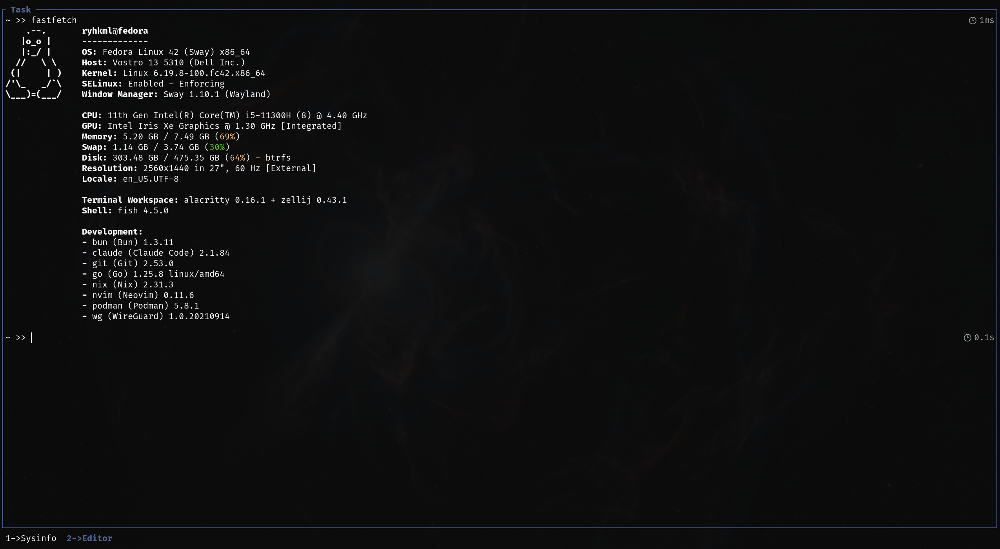
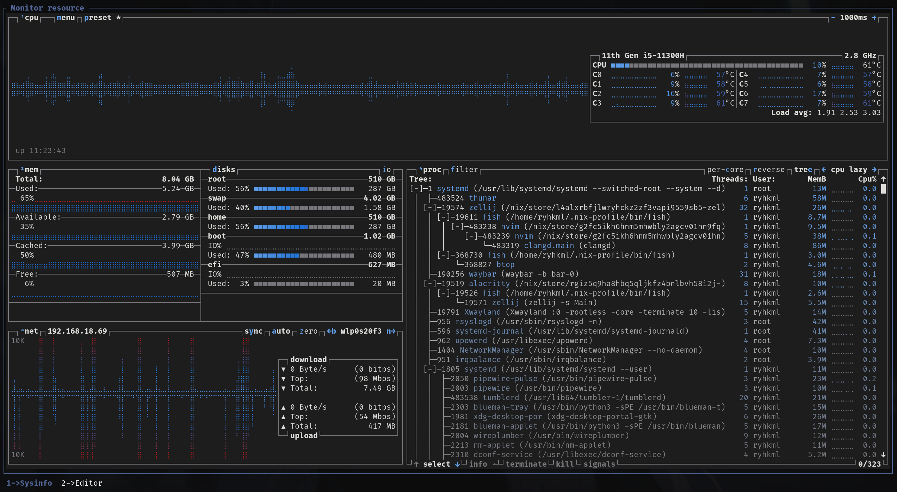
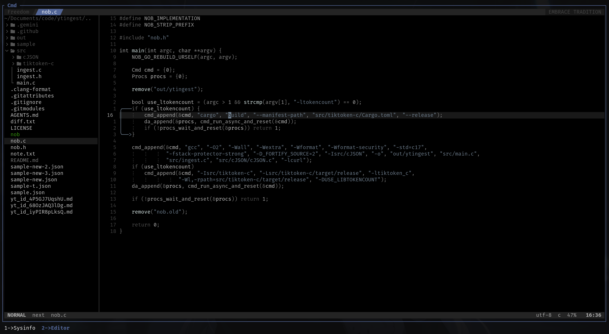
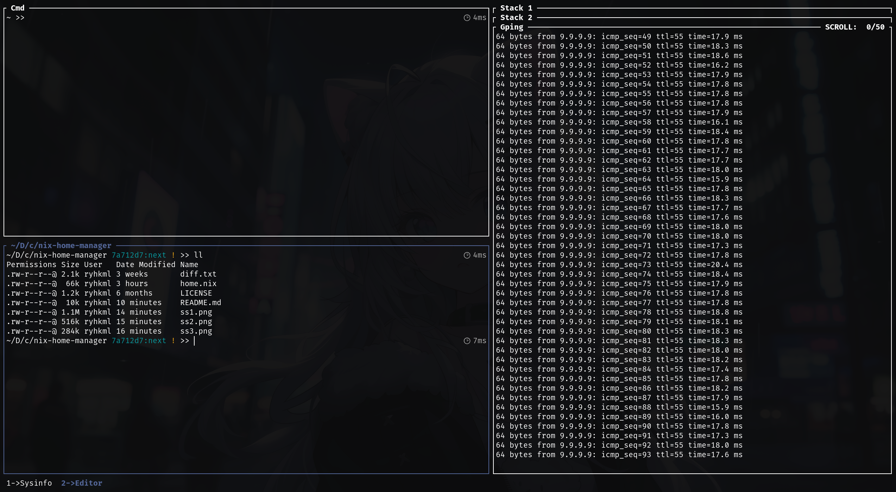

# Nix Home Manager

My home-manager config for Fedora. One `home.nix` file, a pile of Neovim Lua, and the usual overengineered dotfiles.

## Installation

> [!NOTE]
>
> These steps are for a standard (mutable) Linux distribution with single-user Nix. On immutable distros Silverblue, use the [Determinate Systems installer](https://github.com/DeterminateSystems/nix-installer) instead.

1. Install Nix (single-user, no daemon):

   ```sh
   sh <(curl --proto '=https' --tlsv1.2 -L https://nixos.org/nix/install) --no-daemon
   . /home/$USER/.nix-profile/etc/profile.d/nix.sh
   ```

   Nix version:

   ```sh
   nix (Nix) 2.31.3
   ```

   More info at [nixos.org/download](https://nixos.org/download/)

2. Add channels:

   ```sh
   nix-channel --add https://github.com/nix-community/home-manager/archive/master.tar.gz home-manager
   nix-channel --add https://github.com/nix-community/nixGL/archive/main.tar.gz nixgl
   nix-channel --update
   ```

   The `home-manager` channel tracks unstable/master, so packages follow whatever is current on [search.nixos.org/packages](https://search.nixos.org/packages). The `nixgl` channel is for GPU wrappers on non-NixOS systems ([nixGL repo](https://github.com/nix-community/nixGL)).

3. Install Home Manager and create the first generation:

   ```sh
   nix-shell '<home-manager>' -A install
   echo ". /home/$USER/.nix-profile/etc/profile.d/nix.sh" | tee -a ~/.bashrc > /dev/null
   source ~/.bashrc
   ```

4. Verify:
   ```sh
   cat ~/.config/home-manager/home.nix
   ```

## Next step

See the [Home Manager manual](https://nix-community.github.io/home-manager/index.xhtml#sec-usage-configuration) for how to use the `home-manager` command.

## Packages

CLIs, language servers, formatters, and a few plugins.

### A

1. [act](https://nektosact.com) - Run GitHub Actions locally
1. [air](https://github.com/air-verse/air) - Live reload for Go apps
1. [alacritty](https://alacritty.org) - A cross-platform OpenGL terminal emulator
1. [asciiquarium-transparent](https://github.com/nothub/asciiquarium) - Aquarium/sea animation in ASCII art
1. [asm-lsp](https://github.com/bergercookie/asm-lsp) - LSP for Assembly
1. [asmfmt](https://github.com/klauspost/asmfmt) - Formatter for Assembly
1. [astyle](https://astyle.sourceforge.net) - Formatter only for Java

### B

1. [bash-language-server](https://github.com/bash-lsp/bash-language-server) - LSP for Bash
1. [bat](https://github.com/sharkdp/bat) - Alternative to _cat_
1. [beautysh](https://github.com/lovesegfault/beautysh) - Formatter for Shell
1. [binsider](https://github.com/orhun/binsider) - Analyzer of executables using a terminal user interface
1. [black](https://github.com/psf/black) - Formatter for Python
1. [bun](https://bun.sh) - Javascript runtime, bundler, test runner, and package manager
1. [btop](https://github.com/aristocratos/btop) - A monitor of resources

### C

1. [cmus](https://cmus.github.io) - Console music player for Unix-like operating systems

### D

1. [direnv](https://direnv.net) - Unclutter your .profile
1. [docker-language-server](https://github.com/microsoft/compose-language-service) - LSP for Docker Compose
1. [dockerfile-language-server](https://github.com/rcjsuen/dockerfile-language-server) - LSP for Dockerfile
1. [duf](https://github.com/muesli/duf) - Disk usage or free utility. A better _df_ alternative

### E

1. [editorconfig](https://editorconfig.org) - Enforces consistent coding styles across editors and IDEs
1. [exiftool](https://exiftool.org) - Meta information reader or writer

### F

1. [fastfetch](https://github.com/fastfetch-cli/fastfetch) - Neofetch like system information tool
1. [fd](https://github.com/sharkdp/fd) - Alternative to _find_
1. [file](https://darwinsys.com/file) - Shows the type of files
1. [firebase](https://firebase.google.com/docs/cli) - Firebase CLI
1. [fish](https://fishshell.com) - User friendly command line shell
1. [fishPlugins.autopair](https://github.com/jorgebucaran/autopair.fish) - Auto complete matching pairs in the fish command line
1. [fzf](https://github.com/junegunn/fzf) - Command line fuzzy finder

### G

1. [gcloud](https://cloud.google.com/sdk/docs/install) - Google Cloud CLI
1. [go](https://go.dev) - Golang!
1. [go-migrate](https://github.com/golang-migrate/migrate) - Database migrations. CLI and Golang library
1. [gopls](https://pkg.go.dev/golang.org/x/tools/gopls) - LSP for Go
1. [govulncheck](https://pkg.go.dev/golang.org/x/vuln/cmd/govulncheck) - Go vulnerability checker
1. [gping](https://github.com/orf/gping) - Ping, but with a graph

### H

1. [hclfmt](https://github.com/hashicorp/hcl/tree/main/cmd/hclfmt) - Formatter for HCL
1. [hey](https://github.com/rakyll/hey) - HTTP load generator, ApacheBench (ab) replacement
1. [htmx-lsp](https://github.com/ThePrimeagen/htmx-lsp) - LSP for HTMX
1. [huggingface-hub](https://github.com/huggingface/huggingface_hub) - CLI and Python library for HuggingFace Hub
1. [hyperfine](https://github.com/sharkdp/hyperfine) - Command line benchmarking tool

### I

1. [id3v2](https://id3v2.sourceforge.net) - Command line editor for id3v2 tags
1. [isort](https://pycqa.github.io/isort) - Formatter for Python imports

### J

1. [jdt-language-server](https://github.com/eclipse/eclipse.jdt.ls) - LSP for Java
1. [jq](https://jqlang.github.io/jq) - Lightweight and flexible command line JSON processor

### K

1. [k6](https://k6.io) - Modern load testing tool, using Go and JavaScript

### L

1. [latexmk](https://mgeier.github.io/latexmk.html) - TeX Live environment
1. [lazydocker](https://github.com/jesseduffield/lazydocker) - The lazier way to manage everything docker
1. [lazygit](https://github.com/jesseduffield/lazygit) - Terminal UI for git commands
1. [lazysql](https://github.com/jorgerojas26/lazysql) - A cross-platform TUI database management tool written in Go
1. [lua](https://www.lua.org) - Lualang!
1. [lua-language-server](https://github.com/LuaLS/lua-language-server) - LSP for Lua

### M

1. [minify](https://go.tacodewolff.nl/minify) - Web formats minifier

### N

1. [neovim](https://www.neovim.io) - Hyperextensible Vim-based text editor
1. [nil](https://github.com/oxalica/nil) - Yet another LSP for Nix
1. [nixgl](https://github.com/nix-community/nixGL) - A wrapper tool for Nix OpenGL application
1. [nix-prefetch-git](https://github.com/NixOS/nixpkgs/blob/nixos-unstable/pkgs/tools/package-management/nix-prefetch-scripts/default.nix) - Script used to obtain source hashes for fetchgit
1. [nixfmt-rfc-style](https://github.com/NixOS/nixfmt) - Formatter for Nix
1. [nodejs](https://nodejs.org/en) - Event-driven I/O framework for the V8 Javascript engine
1. [nodePackages.prettier](https://prettier.io) - Formatter only for HTML, CSS, JS, TS, and JSON

### O

1. [onefetch](https://github.com/o2sh/onefetch) - Git repository summary on your terminal

### P

1. [packer](https://www.packer.io) - Tool for creating identical machine images
1. [pnpm](https://pnpm.io) - Fast, disk space efficient package manager
1. [podman-compose](https://github.com/containers/podman-compose) - Implementation of docker-compose with podman backend
1. [pyright](https://github.com/microsoft/pyright) - LSP for Python

### R

1. [R](http://www.r-project.org) - Free software environment for statistical computing and graphics
1. [ripgrep](https://github.com/BurntSushi/ripgrep) - Searcher with the raw speed of grep
1. [rlwrap](https://github.com/hanslub42/rlwrap) - A readline wrapper
1. [rtk](https://github.com/rtk-ai/rtk) - Reduces LLM token consumption by 60-90% on common dev commands
1. [rustup](https://www.rustup.rs) - Rust toolchain installer
1. [rust-analyzer](https://rust-analyzer.github.io) - Modular compiler frontend for the Rust language
1. [rustfmt](https://github.com/rust-lang-nursery/rustfmt) - Formatter for Rust

### S

1. [shellcheck](https://hackage.haskell.org/package/ShellCheck) - Shell script analysis tool
1. [stylua](https://github.com/johnnymorganz/stylua) - Formatter for Lua

### T

1. [tailwindcss-language-server](https://github.com/tailwindlabs/tailwindcss-intellisense) - LSP for Tailwind CSS
1. [taplo](https://taplo.tamasfe.dev) - TOML toolkit written in Rust
1. [terraform](https://www.terraform.io) - Tool for building, changing, and versioning infrastructure
1. [terraform-ls](https://github.com/hashicorp/terraform-ls) - LSP for Terraform
1. [tesseract](https://github.com/tesseract-ocr/tesseract) - OCR engine
1. [tex-fmt](https://github.com/WGUNDERWOOD/tex-fmt) - Formatter for TeX
1. [texlab](https://github.com/latex-lsp/texlab) - LSP for TeX
1. [tokei](https://github.com/XAMPPRocky/tokei) - Count your code quickly
1. [tree-sitter](https://github.com/tree-sitter/tree-sitter) - Parser generator tool and an incremental parsing library
1. [typescript](https://www.typescriptlang.org) - Javascript with syntax for types
1. [typescript-language-server](https://github.com/typescript-language-server/typescript-language-server) - LSP for Typescript using tsserver

### U

1. [ueberzugpp](https://github.com/jstkdng/ueberzugpp) - Display images in terminal emulators
1. [unar](https://theunarchiver.com) - Archive unpacker program
1. [uv](https://docs.astral.sh/uv) - Fast Python package manager

### V

1. [vscode-langservers-extracted](https://github.com/hrsh7th/vscode-langservers-extracted) - LSP extracted from Vscode only for HTML/CSS/JSON/ESLint

### Y

1. [yamlfmt](https://github.com/google/yamlfmt) - Formatter for YAML
1. [yaml-language-server](https://github.com/redhat-developer/yaml-language-server) - LSP for YAML
1. [yt-dlp](https://github.com/yt-dlp/yt-dlp) - Command line tool to download videos from Youtube and other sites

### Z

1. [zellij](https://zellij.dev) - A terminal workspace
1. [zig](https://ziglang.org) - Ziglang!
1. [zls](https://github.com/zigtools/zls) - LSP for Zig
1. [zoxide](https://github.com/ajeetdsouza/zoxide) - Fast _cd_ that learns your habits

## Uninstalling Nix and Home Manager (single-user)

Delete everything nix-related:

```sh
nix-collect-garbage
nix-collect-garbage -d
rm -rf ~/.cache/nix \
    ~/.config/nix ~/.config/home-manager \
    ~/.local/share/nix ~/.local/share/home-manager \
    ~/.local/state/nix ~/.local/state/home-manager \
    ~/.nix-channels ~/.nix-defexpr ~/.nix-profile
sudo rm -rf /nix
```

Then remove these lines from `.bashrc` and `.bash_profile`:

```sh
# .bash_profile
if [ -e /home/user/.nix-profile/etc/profile.d/nix.sh ]; then . /home/user/.nix-profile/etc/profile.d/nix.sh; fi
# .bashrc
. "$HOME"/.nix-profile/etc/profile.d/nix.sh
```

## Screenshot

#### fastfetch



#### btop



#### nvim



#### zellij


